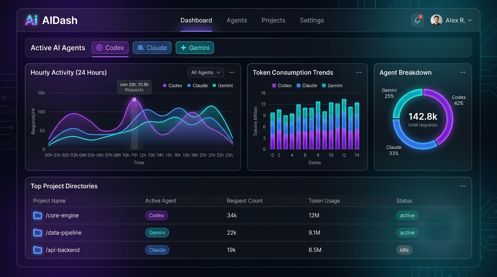

# AIDash — AI Usage Dashboard

[](https://github.com/Tharun1045/ai-usage-tracker/releases/latest)
[](https://github.com/Tharun1045/ai-usage-tracker/releases/latest)
[](LICENSE)

> 🌐 **100% Internet-Free** &nbsp;|&nbsp; 🔒 **Privacy Safe** &nbsp;|&nbsp; ⚡ **Works Offline**

A local, privacy-safe token usage and cost tracker for developer AI tools. It automatically detects and visualizes your usage from the AI coding tools installed on your machine — **only showing the ones you've actually used**.

> **🧠 Smart Detection**: AIDash has built-in compatibility for 8 AI agents, but it will only display the tools you have actively used. If you only use Cursor and GitHub Copilot, you'll only see those two — nothing else clutters the view.



---

## 🤖 Compatible AI Agents

AIDash has built-in support for the following tools. It will automatically detect and show **only the ones present on your machine**:

| Agent | Provider |
|---|---|
| OpenAI Codex | OpenAI |
| Anthropic Claude | Anthropic |
| Google Gemini | Google |
| GitHub Copilot | GitHub / Microsoft |
| Cursor | Anysphere |
| Groq | Groq |
| Cline | Cline (VS Code Extension) |
| Roo Code | Roo Code (VS Code Extension) |

---

## 🔒 Privacy & Offline Guarantee

- **100% Internet-Free**: AIDash works entirely offline. All fonts, charts, and icons are bundled inside the app — no CDN calls, no external requests, ever.
- **Zero API calls / network uploads**: All operations occur entirely on your local machine. Your logs never leave your device.
- **No credentials accessed**: The application never touches or reads any API keys or auth tokens.
- **Local SQLite DB**: Aggregated metrics are stored in a private, local SQLite database (`~/.codex/codex_usage.db`).
- **localhost only**: The dashboard runs on `http://localhost:8080` — only accessible from your own machine. Nobody on the internet or your local WiFi can open it.

---

## 🚀 Getting Started

### ✅ Method A: One-Click Executable (Zero Setup — Recommended)

No Python, Node.js, or Git required. Works on any Windows machine.

## ⬇️ [Download AIDash.exe — Latest Release](https://github.com/Tharun1045/ai-usage-tracker/releases/latest/download/AIDash.exe)

**Steps:**
1. Click the download link above to get **`AIDash.exe`**.
2. **Double-click** `AIDash.exe`.
3. It will automatically:
   - Scan your machine for AI tool logs
   - Start the local dashboard server
   - Open your browser at **[http://localhost:8080](http://localhost:8080)**
4. To stop it, close the terminal/console window that appears.

> ⚠️ **Windows SmartScreen Warning**: The first time you run it, Windows may show a "Windows protected your PC" message. Click **"More info" → "Run anyway"**. This is normal for unsigned executables.

> 💡 **Only your tools appear**: AIDash detects which AI agents you have logs for and shows only those — tabs, charts, and legends are all filtered dynamically.

---

### 🛠️ Method B: Developer Setup (Run from Source)

#### Requirements
- Python 3.8+ installed

#### Steps

**1. Clone the repository**
```bash
git clone https://github.com/your-username/ai-usage-tracker.git
cd ai-usage-tracker
```

**2. Scan your local AI logs**
```bash
python cli.py scan
```

**3. View stats in terminal**
```bash
python cli.py stats
```

**4. Launch the web dashboard**
```bash
python cli.py dashboard
```
This will auto-scan your logs, start the server, and open your browser at **[http://localhost:8080](http://localhost:8080)**.

---

## 💻 Dashboard Features

Once AIDash is open in your browser:

- **Dynamic Agent Tabs**: Only shows tabs for AI tools you've actually used. Unused agents are hidden automatically.
- **Hourly Activity (24 Hours)**: Line chart of token usage per hour across your active agents.
- **Daily Consumption Trend**: Stacked bar chart (7D / 30D / 3M / 6M / 1Y) showing usage per agent.
- **Agent Breakdown (Doughnut Chart)**: Shows your overall share of usage per tool.
- **Top Projects**: Ranked list of your projects by token consumption.
- **Top Sessions & Models**: Deep dive into individual chat sessions and model breakdowns.
- **Instant Scan Button**: Click 🔄 in the header to re-scan logs without restarting the server.
- **Date Filter**: View stats for a specific day using the date picker.
